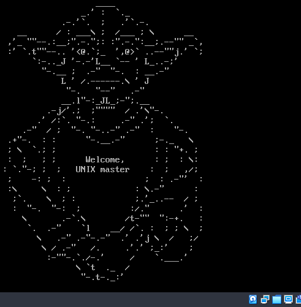

# Первая лабораторная работа

## Задание

Создать dracut модуль который выводит какое-либо сообщение при загрузке.

## Описание

В этой лаб. работе покажу модуль для dracut, который при установке выведет картинку йоды и задержит запуск системы на 20 секунд в целях наглядной демонстрации этого пингвинчика при запуске.

## Установка

Для установки необходимо запустить vagrant:

```bash
vagrant up
vagrant provision
```

Далее у вас появится экран с машиной.

Если с первого раза не получилось запустить, то нужно:

```bash
vagrant halt
vagrant up
vagrant provision
```

## Результат

Перезагружаемся:

```bash
reboot
```

И видим результат.


